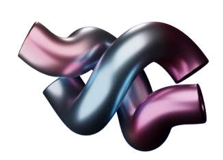

<!DOCTYPE html>
<html lang="en">

<head>
    <meta charset="UTF-8">
    <meta name="viewport" content="width=device-width, initial-scale=1.0">

    <!-- Google Font -->
    <link rel="preconnect" href="https://fonts.googleapis.com">
    <link rel="preconnect" href="https://fonts.gstatic.com" crossorigin>

    <link href="https://fonts.googleapis.com/css2?family=Cormorant+Garamond:wght@400;500;700&family=Poppins:wght@300;400;500;600;700&display=swap" rel="stylesheet">
    <link rel="stylesheet" href="https://cdnjs.cloudflare.com/ajax/libs/font-awesome/6.6.0/css/all.min.css">
    <link rel="stylesheet" href="style.css">

    <title>Creative Portfolio</title>
</head>

<body>

    <!--================ NAVBAR ================-->

    <header>

        

            Devi Fadillah
        

        <nav>

            <a href="#home">Home</a>
            <a href="#kata">Kata Pengantar</a>
            <a href="#about">Tentang</a>
            <a href="#visi">Visi Misi</a>
            <a href="#education">Pendidikan</a>
            <a href="#pengalaman">Pengalaman</a>
            <a href="#skill">Keterampilan</a>
            <a href="#profile">Profil</a>
            <a href="#prestasi">Prestasi</a>
            <a href="#certificate">Sertifikat</a>
            <a href="#project">Proyek</a>
            <a href="#contact">Kontak</a>

        </nav>

    </header>

    <!--================ HOME =================-->

    <section class="hero" id="home">

        

        

        

        

        

            <h1>Devi Fadillah</h1>

            <h3>Kreatif Portofolio</h3>

        

    </section>

    <!--================ KATA PENGANTAR =================-->

    <section class="section" id="kata">

        

        

        <h5>Devi Fadillah</h5>

        

            <h2>Kata Pengantar</h2>

            

                Lorem ipsum dolor sit amet, consectetur adipisicing elit.
                Sed non orci hendrerit augue interdum lacinia at egestas
                dolor. Vivamus elementum pulvinar tempus.
            

            

                Lorem ipsum dolor sit amet, consectetur adipisicing elit.
                Sed non orci hendrerit augue interdum lacinia at egestas
                dolor. Vivamus elementum pulvinar tempus.
            

        

        <small>Kreatif Portofolio</small>

    </section>

    <!--================ ABOUT =================-->

    <section class="section" id="about">

        

        

        <h5>Devi Fadillah</h5>

        

            <h2>Tentang Saya</h2>

            

                Lorem ipsum dolor sit amet, consectetur adipisicing elit.
                Sed non orci hendrerit augue interdum lacinia at egestas
                dolor. Vivamus elementum pulvinar tempus.
            

            

                Lorem ipsum dolor sit amet, consectetur adipisicing elit.
                Sed non orci hendrerit augue interdum lacinia at egestas
                dolor. Vivamus elementum pulvinar tempus.
            

        

        <small>Kreatif Portofolio</small>

    </section>

    <!--================ VISI MISI =================-->

    <section class="section visi" id="visi">

        

        

        

        <h5>Devi Fadillah</h5>

        

            

                <h2>Visi</h2>

                

                    Lorem ipsum dolor sit amet, consectetur adipisicing elit.
                    Sed non orci hendrerit augue interdum lacinia at egestas
                    dolor. Vivamus elementum pulvinar tempus.
                

            

            

                <h2>Misi</h2>

                

                    Lorem ipsum dolor sit amet, consectetur adipisicing elit.
                    Sed non orci hendrerit augue interdum lacinia at egestas
                    dolor. Vivamus elementum pulvinar tempus.
                

            

        

        <small>Kreatif Portofolio</small>

    </section>

    <!--================ PENDIDIKAN =================-->

    <section class="section education" id="education">

        

        

        <h5>Devi Fadillah</h5>

        

            <h2>Pendidikan</h2>

            

                <h3>Sekolah Seni</h3>

                <h4>2003 - 2005</h4>

                

                    Lorem ipsum dolor sit amet consectetur adipisicing elit.
                    Sed non orci hendrerit augue interdum lacinia at egestas
                    dolor.
                

            

            

                <h3>Sekolah Desain</h3>

                <h4>2006 - 2009</h4>

                

                    Lorem ipsum dolor sit amet consectetur adipisicing elit.
                    Sed non orci hendrerit augue interdum lacinia at egestas
                    dolor.
                

            

        

        <small>Creative Portfolio</small>

    </section>

<!--================ PENGALAMAN =================-->

<section class="section pengalaman" id="pengalaman">

    
    

    <h5>Devi Fadillah</h5>

    

        <h2>Pengalaman Kerja</h2>

        

            <h3>Perancang Desain</h3>
            <h4>2010 - 2013</h4>

            

                Lorem ipsum dolor sit amet, consectetur adipisicing elit.
                Sed non orci hendrerit augue interdum lacinia at egestas dolor.
            

        

        

            <h3>Grafik Desainer</h3>
            <h4>2013 - 2024</h4>

            

                Lorem ipsum dolor sit amet, consectetur adipisicing elit.
                Sed non orci hendrerit augue interdum lacinia at egestas dolor.
            

        

    

    <small>Kreatif Portofolio</small>

</section>

<!--================ KETERAMPILAN =================-->

<section class="section skill" id="skill">

    
    

    <h5>Devi Fadillah</h5>

    

        <h2>Keterampilan</h2>

        

            Administrasi

            

                

            

        

        

            Input Data

            

                

            

        

        

            Komunikasi

            

                

            

        

        

            Manajemen Waktu

            

                

            

        

    

    <small>Kreatif Portofolio</small>

</section>

<section class="section" id="profile">

    

    

    <h5>Devi Fadillah</h5>

    

        <h2>Profil Singkat</h2>

        

            Saya adalah mahasiswa yang memiliki minat di bidang administrasi,
            pengolahan data, dan desain. Saya senang mempelajari hal-hal baru,
            mampu bekerja sama dalam tim maupun secara mandiri, serta selalu
            berusaha menyelesaikan pekerjaan dengan teliti dan tepat waktu.
        

    

    <small>Kreatif Portofolio</small>
</section>

<section class="section" id="prestasi">

    <h5>Devi Fadillah</h5>

    

        <h2>Prestasi</h2>

        

            <h3>Juara 2 Lomba Desain Poster</h3>
            <h4>2024</h4>
            
Mewakili sekolah dalam kompetisi desain tingkat kota.

        

        

            <h3>Sertifikat Microsoft Office</h3>
            <h4>2025</h4>
            
Mengikuti pelatihan Microsoft Word, Excel, dan PowerPoint.

        

    

    <small>Kreatif Portofolio</small>

</section>

<section class="section" id="certificate">

    
    

    <h5>Devi Fadillah</h5>

    

        <h2>Sertifikat</h2>

        

            <h3>Microsoft Office</h3>

            

                Sertifikat pelatihan Microsoft Word, Excel, dan PowerPoint.
            

        

        

            <h3>Canva Design</h3>

            

                Sertifikat pelatihan desain grafis menggunakan Canva.
            

        

    

    <small>Kreatif Portofolio</small>

</section>

<section class="section" id="project">
    
    

    <h5>Devi Fadillah</h5>

    

        <h2>Proyek</h2>

        

            <h3>Website Portofolio</h3>

            

                Membuat website portofolio menggunakan HTML, CSS, dan JavaScript
                yang menampilkan profil, pendidikan, pengalaman, dan keterampilan.
            

        

        

            <h3>Sistem Pendataan Barang</h3>

            

                Membuat aplikasi Java sederhana untuk mengelola data barang dan stok.
            

        

    

    <small>Kreatif Portofolio</small>

</section>

<section class="section" id="contact">

    

    

    

    <h5>Devi Fadillah</h5>

    

        <h2>Mari Bekerja Sama</h2>

        
📧 Email : devifadillah@email.com

        
📱 WhatsApp : 08xxxxxxxxxx

        
📍 Medan, Indonesia

    

    <small>Kreatif Portofolio</small>

</section>

    

</body>

</html>
